# Screenshot:

# Screenshot:

# Screenshot:

# Screenshot:

# Screenshot:

# Screenshot:

# Screenshot:

# Screenshot:

# 1. System Architecture Diagram
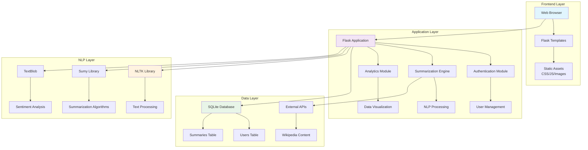

# 2. Database Schema Diagram
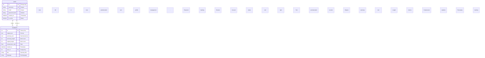

# 3. User Authentication Flowchart
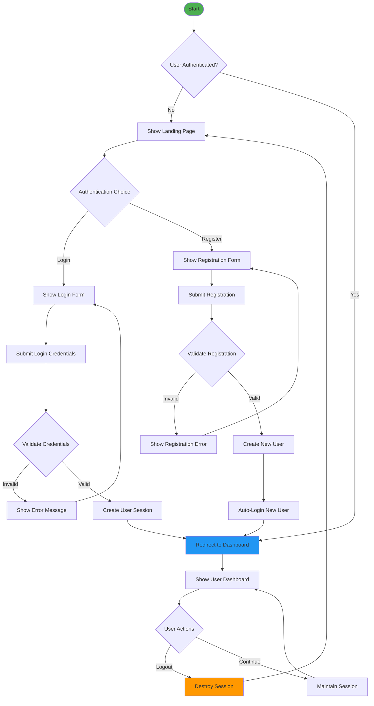

# 4. Text Summarization Workflow
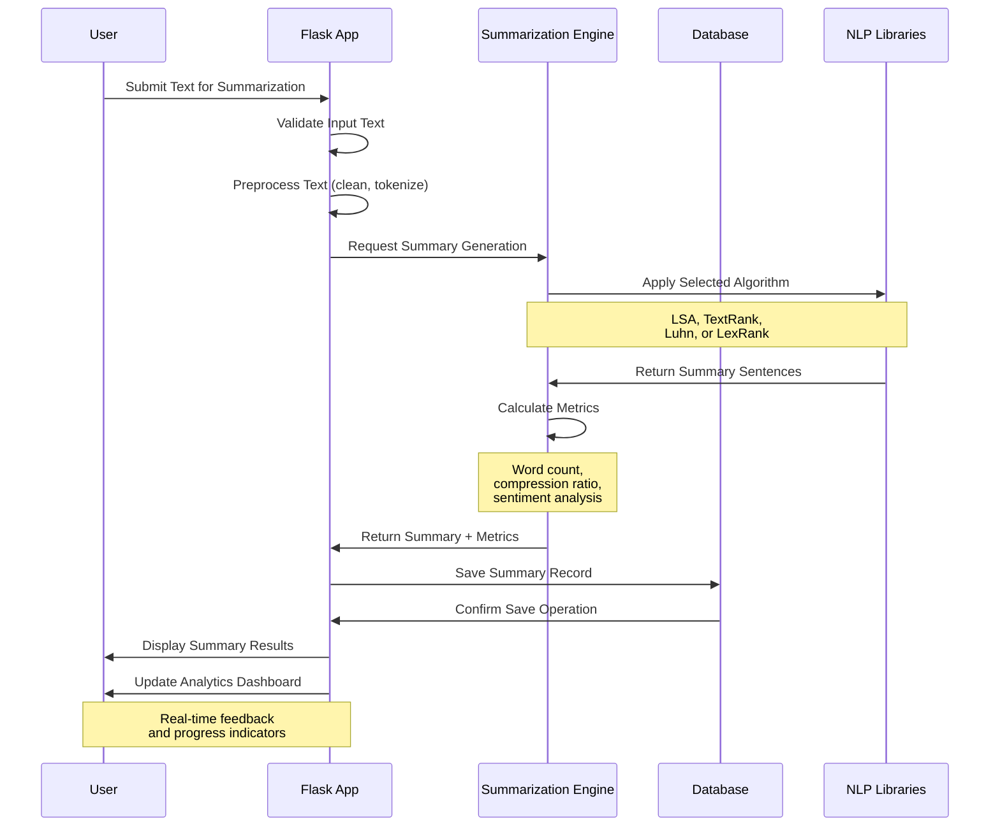

# 5. Component Relationship Diagram
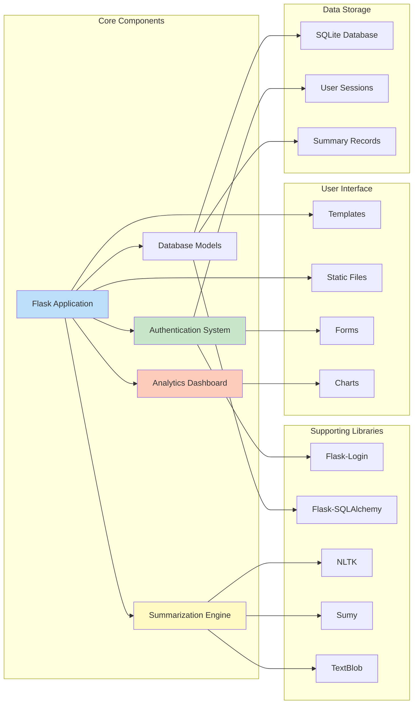

# 6. Data Flow Diagram
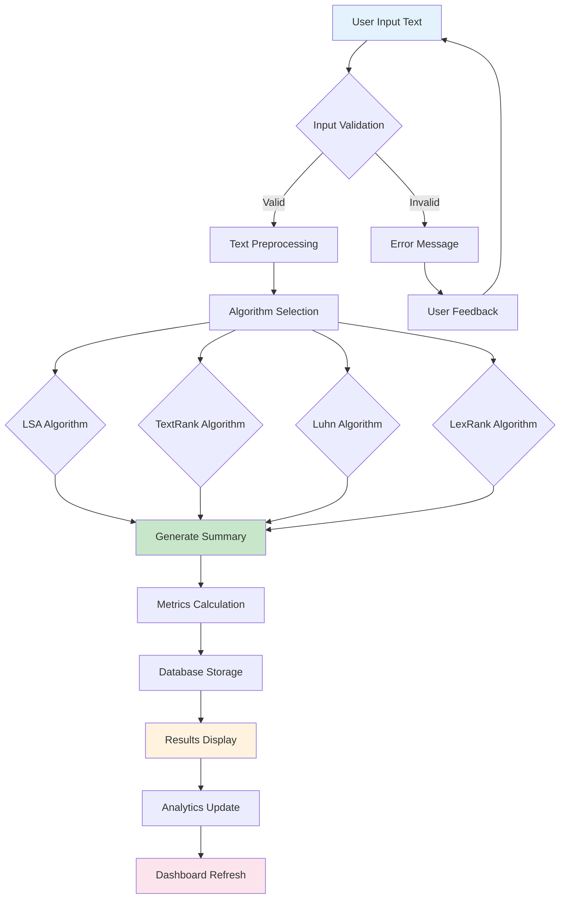

# 7. User Journey Map
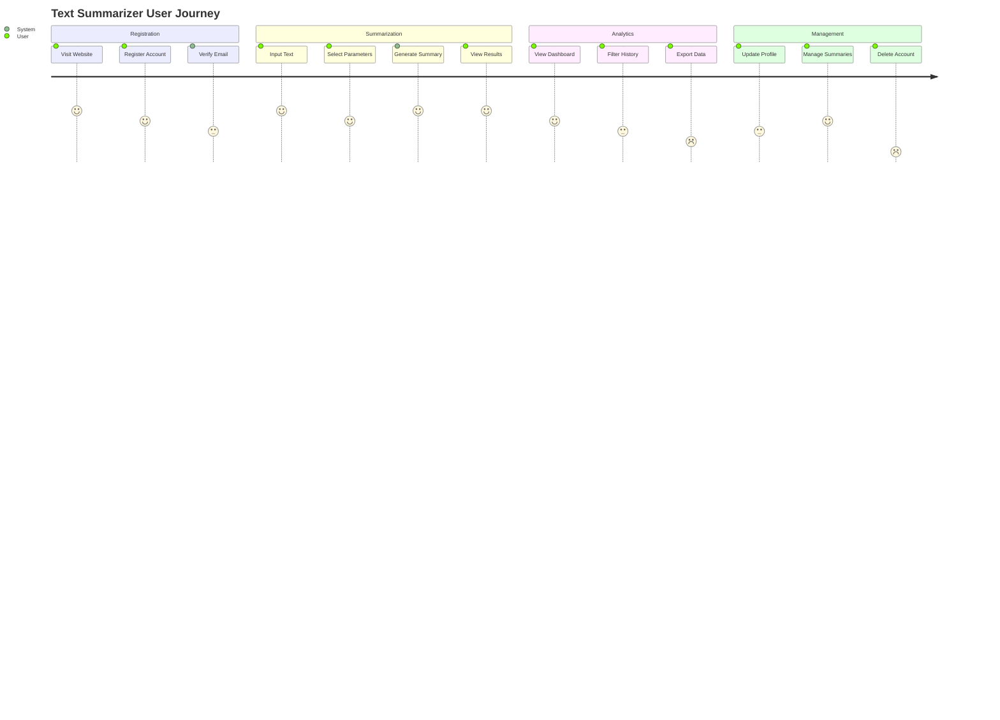

# 8. Deployment Architecture
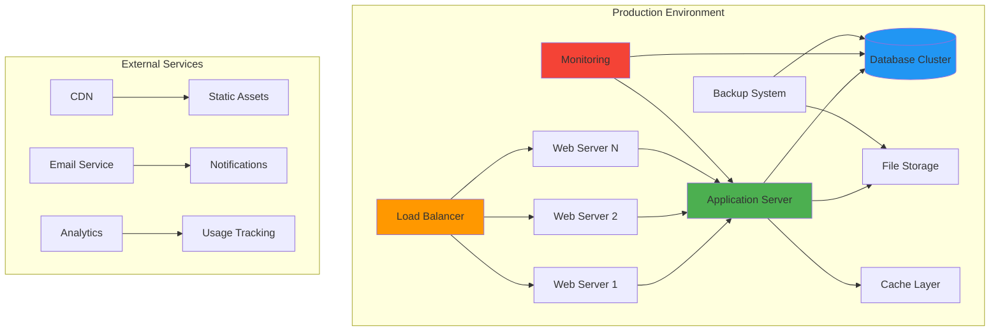

# 9. API Endpoints Diagram
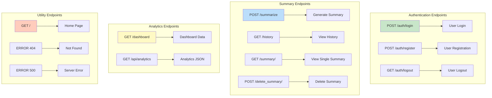

# 10. Security Architecture Diagram
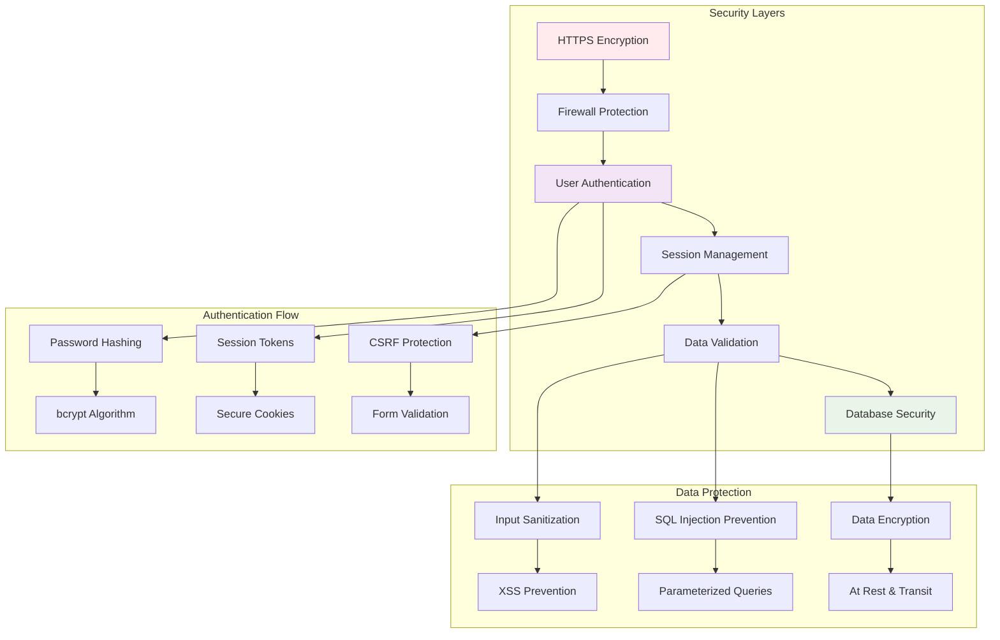

# 11. Testing Strategy Diagram
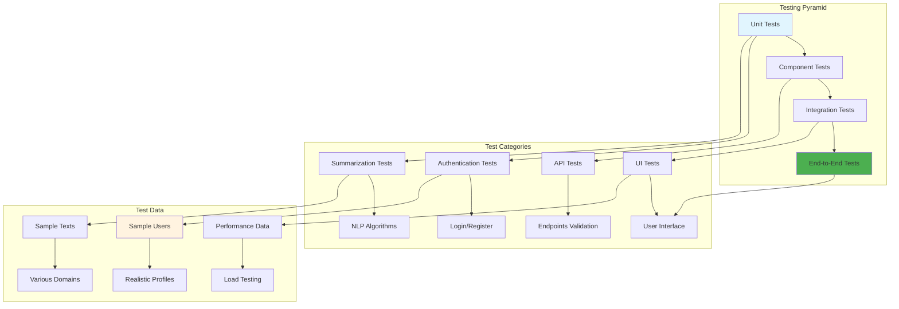

# 12. Monitoring and Analytics Diagram
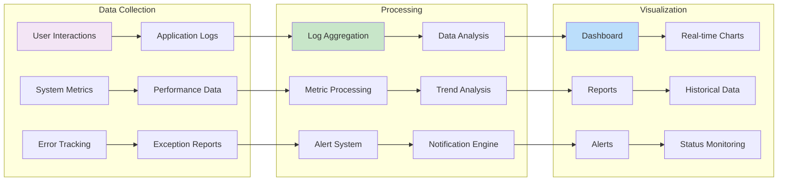
